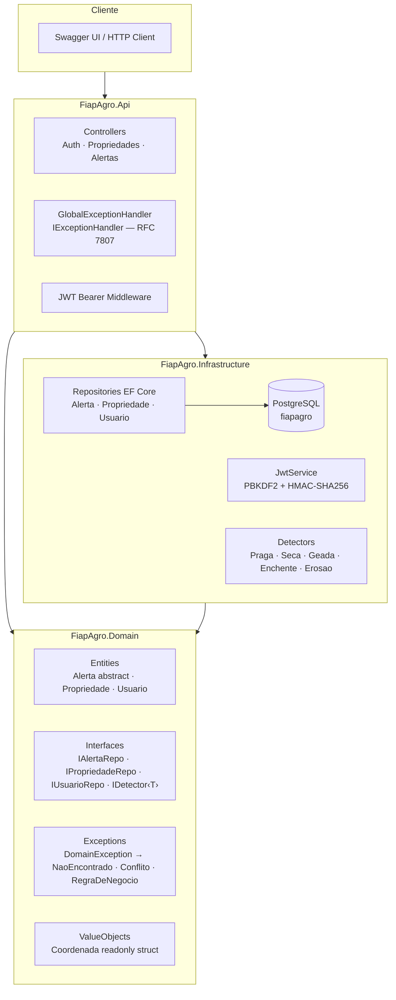
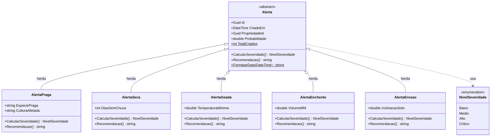
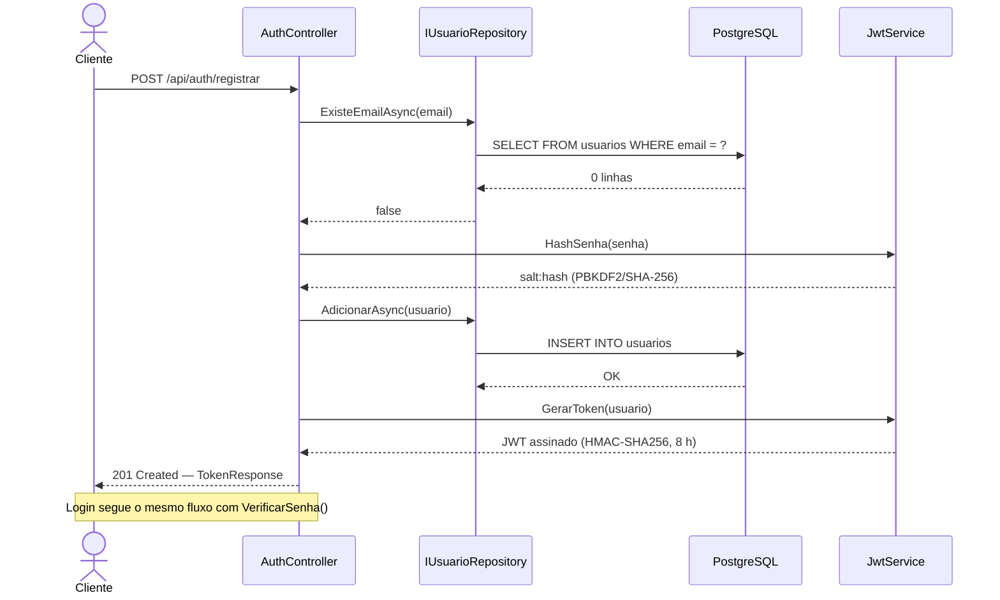
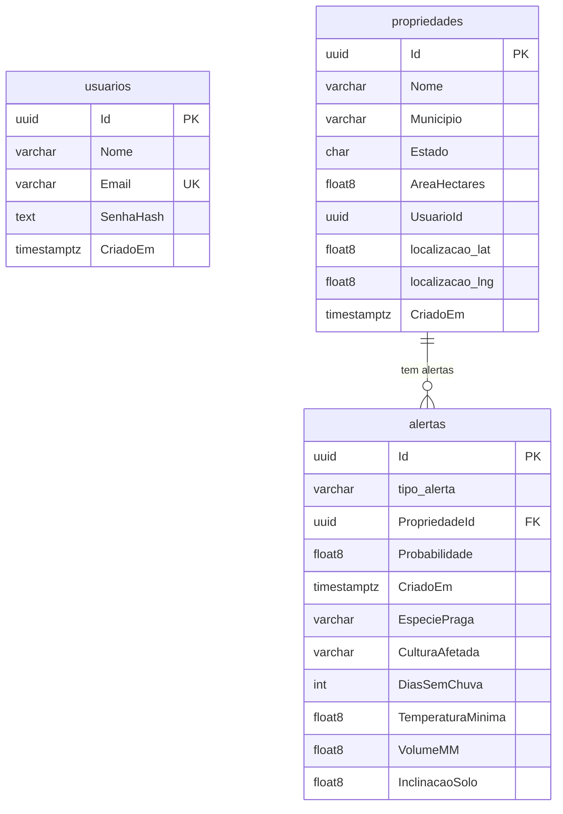

# FiapAgro — Backend

> API REST .NET 8 para monitoramento agroclimático — FIAP Global Solution 2026.1

[](https://github.com/GS-SPACE-CONNECT/2f-agro-backend/actions)
[](https://github.com/GS-SPACE-CONNECT/2f-agro)
[](https://dotnet.microsoft.com)

---

## Sobre o Projeto

O **FiapAgro Backend** é uma Web API que detecta e registra alertas agroclimáticos (pragas, secas, geadas, enchentes e erosão) para propriedades rurais cadastradas. Desenvolvido em C# .NET 8, atende às rubricas de **C# (100 pts)** e **SOA** da FIAP 3ES — GS 2026.1.

## Equipe

| GitHub | Nome |
|--------|------|
| [@brnleao](https://github.com/brnleao) | Bruno Leão |
| [@DevRuanVieira](https://github.com/DevRuanVieira) | Ruan Vieira |
| [@jota0802](https://github.com/jota0802) | José Otávio |

---

## Stack Técnica

| Componente | Tecnologia |
|---|---|
| Runtime | .NET 8 (C# 12) |
| Web Framework | ASP.NET Core Web API |
| ORM | Entity Framework Core 8 |
| Banco de Dados | PostgreSQL 15 + Npgsql 8 |
| Autenticação | JWT Bearer — HMAC-SHA256 |
| Hash de senha | PBKDF2/SHA-256 (`Rfc2898DeriveBytes`, 10 000 iterações) |
| Documentação | Swagger / OpenAPI (Swashbuckle 6) |
| Testes | xUnit 2.5 |
| Exceções | `IExceptionHandler` .NET 8 + RFC 7807 ProblemDetails |

---

## Arquitetura

O projeto segue a **Arquitetura em Camadas** com dependências unidirecionais:

```
FiapAgro.Api  →  FiapAgro.Domain  ←  FiapAgro.Infrastructure
```

### Diagrama de Camadas



---

### Diagrama de Classes — Hierarquia de Alertas



---

### Diagrama de Fluxo — Ciclo de Autenticação



---

### Diagrama de Fluxo — Tratamento de Exceções


---

### Diagrama ER — Banco de Dados



> `alertas` usa **Table-Per-Hierarchy (TPH)**: uma única tabela com coluna discriminadora `tipo_alerta`.

---

## Rubrica C# — Checklist

| # | Item | Pts | Implementação |
|---|------|:---:|---|
| 4 | Classes abstratas + herança + polimorfismo | 20 | `Alerta` (abstract) → 5 herdeiros; `CalcularSeveridade()` e `Recomendacao()` sobrescritos em cada subclasse |
| 5 | Interfaces + injeção de dependência | 20 | `IAlertaRepository`, `IPropriedadeRepository`, `IUsuarioRepository`, `IDetector<T>`, `INotificador` — todos Scoped via `AddFiapAgroServices()` |
| 6 | Structs + Partial Classes | 5 | `readonly struct Coordenada` (GPS, value-semantics, IEquatable); `partial class Propriedade` (estado / comportamento em arquivos separados) |
| 7 | EF Core + migrations + PostgreSQL | 20 | TPH para `Alerta`, `ComplexProperty` para `Coordenada`, 2 migrations, seed automático na startup |
| 8 | Controllers + endpoints REST | 10 | 3 controllers · 15 endpoints · DTOs tipados (records) · `CreatedAtAction` |
| 9 | Tratamento de exceções | 10 | Hierarquia `DomainException` → `GlobalExceptionHandler` (`IExceptionHandler` .NET 8) → RFC 7807 ProblemDetails com `traceId` |
| 10 | Auth + JWT | 15 | `JwtService` (PBKDF2 + HMAC-SHA256) · `AuthController` · `[Authorize]` · Swagger Bearer |
| 11 | README + diagrama + evidências | 30 | Este arquivo + Mermaid (camadas · classes · fluxo · ER) + `docs/evidencias/` |
| | **Total** | **130** | |

---

## Endpoints REST

### Auth (público)

| Método | Rota | Status | Descrição |
|--------|------|:------:|-----------|
| `POST` | `/api/auth/registrar` | 201 | Cadastra usuário e retorna JWT |
| `POST` | `/api/auth/login` | 200 | Autentica e retorna JWT |

### Propriedades (🔒 Bearer JWT)

| Método | Rota | Status | Descrição |
|--------|------|:------:|-----------|
| `GET` | `/api/propriedades?usuarioId={guid}` | 200 | Lista propriedades do usuário |
| `GET` | `/api/propriedades/{id}` | 200 / 404 | Busca por Id |
| `POST` | `/api/propriedades` | 201 | Cadastra nova propriedade |
| `PUT` | `/api/propriedades/{id}` | 200 / 404 | Atualiza dados |
| `DELETE` | `/api/propriedades/{id}` | 204 / 404 | Remove propriedade |

### Alertas (🔒 Bearer JWT)

| Método | Rota | Status | Descrição |
|--------|------|:------:|-----------|
| `GET` | `/api/alertas/recentes?quantidade=20` | 200 | Últimos N alertas |
| `GET` | `/api/alertas/propriedade/{id}` | 200 | Alertas de uma propriedade |
| `GET` | `/api/alertas/{id}` | 200 / 404 | Alerta por Id |
| `POST` | `/api/alertas/praga` | 201 | Registra alerta de praga |
| `POST` | `/api/alertas/seca` | 201 | Registra alerta de seca |
| `POST` | `/api/alertas/geada` | 201 | Registra alerta de geada |
| `POST` | `/api/alertas/enchente` | 201 | Registra alerta de enchente |
| `POST` | `/api/alertas/erosao` | 201 | Registra alerta de erosão |

Erros retornam **ProblemDetails (RFC 7807)**:

```json
{
  "status": 404,
  "title": "Recurso não encontrado",
  "detail": "Propriedade 'abc...' não encontrado.",
  "traceId": "00-abc123..."
}
```

---

## Configuração e Execução

### Pré-requisitos

- [.NET 8 SDK](https://dotnet.microsoft.com/download/dotnet/8.0)
- PostgreSQL 15+ (veja opções abaixo)

### 1. Banco de dados — escolha uma opção

**Docker (recomendado):**
```bash
docker run --name fiapagro-pg \
  -e POSTGRES_USER=postgres \
  -e POSTGRES_PASSWORD=postgres \
  -e POSTGRES_DB=fiapagro \
  -p 5432:5432 -d postgres:15
```

**PostgreSQL local já instalado** — crie o banco:
```bash
createdb -U postgres fiapagro
```

A connection string padrão em `appsettings.json` já está configurada para `localhost:5432` com usuário/senha `postgres`:
```
Host=localhost;Port=5432;Database=fiapagro;Username=postgres;Password=postgres
```
Ajuste o arquivo se seu PostgreSQL usar credenciais diferentes.

### 2. Restaurar pacotes

```bash
dotnet restore
```

### 3. Subir a API

```bash
dotnet run --project FiapAgro.Api
```

> As migrations e o seed de dados rodam **automaticamente** na startup — não é necessário rodar `dotnet ef database update` manualmente.

A API inicia em `http://localhost:5000` · Swagger abre automaticamente em `http://localhost:5000/swagger`.

### 4. Testes unitários

```bash
dotnet test --verbosity normal
```

### (Opcional) Gerenciar migrations manualmente

```bash
# Instalar ferramenta global (uma vez)
dotnet tool install --global dotnet-ef --version 8.0.11

# Aplicar migrations sem subir a API
dotnet ef database update --project FiapAgro.Infrastructure --startup-project FiapAgro.Api

# Criar nova migration após alterar o modelo
dotnet ef migrations add NomeDaMigration --project FiapAgro.Infrastructure --startup-project FiapAgro.Api
```

---

## Evidências de Execução

Saídas reais capturadas com a API rodando em `http://localhost:5000` contra PostgreSQL 15 local.  
Arquivo de requisições completo: [`docs/evidencias/requests.http`](docs/evidencias/requests.http)

---

### Console — Startup + Migrations + Seed

```
info: Microsoft.EntityFrameworkCore.Migrations[20405]
      No migrations were applied. The database is already up to date.
info: Microsoft.EntityFrameworkCore.Database.Command[20101]
      Executed DbCommand (2ms) [...] SELECT EXISTS (SELECT 1 FROM propriedades AS p)
info: Microsoft.EntityFrameworkCore.Database.Command[20101]
      Executed DbCommand (10ms) [...] INSERT INTO propriedades (...) VALUES (...);  -- seed: 2 propriedades
info: Microsoft.EntityFrameworkCore.Database.Command[20101]
      Executed DbCommand (2ms) [...] INSERT INTO alertas (...) VALUES (...);        -- seed: 5 alertas
info: Microsoft.Hosting.Lifetime[14]
      Now listening on: http://localhost:5000
info: Microsoft.Hosting.Lifetime[0]
      Application started. Press Ctrl+C to shut down.
info: Microsoft.Hosting.Lifetime[0]
      Hosting environment: Development
info: Microsoft.Hosting.Lifetime[0]
      Content root path: C:\...\FiapAgro.Api
```

---

### Migrations do zero (`dotnet ef database update`)

```
Build started...
Build succeeded.
Applying migration '20260601230202_Initial'.
Applying migration '20260602002805_AddUsuario'.
Done.
```

---

### POST /api/auth/registrar → 201 Created

```http
POST http://localhost:5000/api/auth/registrar
Content-Type: application/json

{ "nome": "Bruno Leao", "email": "bruno@fiapagro.com", "senha": "Senha@123" }
```

```json
HTTP/1.1 201 Created

{
  "token": "eyJhbGciOiJIUzI1NiIsInR5cCI6IkpXVCJ9.eyJzdWIiOiI1ZWRmYmE1...",
  "nome": "Bruno Leao",
  "email": "bruno@fiapagro.com",
  "expira": "2026-06-02T10:52:14.1331616Z"
}
```

---

### POST /api/auth/login → 200 OK

```json
HTTP/1.1 200 OK

{
  "token": "eyJhbGciOiJIUzI1NiIsInR5cCI6IkpXVCJ9.eyJzdWIiOiI1ZWRmYmE1...",
  "nome": "Bruno Leao",
  "email": "bruno@fiapagro.com",
  "expira": "2026-06-02T10:52:28.2934858Z"
}
```

---

### POST /api/propriedades → 201 Created

```json
HTTP/1.1 201 Created

{
  "id": "68a9c102-0951-41c0-93b3-f0c8e94621ad",
  "nome": "Fazenda Boa Vista",
  "municipio": "Ribeirao Preto",
  "estado": "SP",
  "areaHectares": 250.5,
  "usuarioId": "00000000-0000-0000-0000-000000000001",
  "descricao": "Fazenda Boa Vista — Ribeirao Preto/SP (250,5 ha) @ (-21,170400, -47,810300)",
  "criadoEm": "2026-06-02T02:52:33.8467207Z"
}
```

---

### POST /api/alertas/praga → 201 Created (severidade Critico)

```json
HTTP/1.1 201 Created

{
  "id": "77acf987-8c1f-4817-a55d-bbdb1ddf870f",
  "propriedadeId": "68a9c102-0951-41c0-93b3-f0c8e94621ad",
  "tipo": "AlertaPraga",
  "severidade": "Critico",
  "probabilidade": 0.87,
  "recomendacao": "Aplicar defensivo imediatamente contra lagarta-do-cartucho na cultura de milho.",
  "criadoEm": "01/06/2026 23:52"
}
```

---

### GET /api/alertas/recentes → 200 OK

```json
HTTP/1.1 200 OK

[
  {
    "id": "77acf987-8c1f-4817-a55d-bbdb1ddf870f",
    "tipo": "AlertaPraga",
    "severidade": "Critico",
    "probabilidade": 0.87,
    "recomendacao": "Aplicar defensivo imediatamente contra lagarta-do-cartucho na cultura de milho.",
    "criadoEm": "01/06/2026 23:52"
  },
  {
    "id": "ce2fb5cc-2806-4660-ac4c-983381d1cab9",
    "tipo": "AlertaErosao",
    "severidade": "Medio",
    "probabilidade": 0.55,
    "recomendacao": "Inclinação de 22,0° — monitorar erosão e manter cobertura do solo.",
    "criadoEm": "01/06/2026 23:52"
  },
  {
    "id": "e0472843-89c3-47c7-aba0-625f2f9d7846",
    "tipo": "AlertaEnchente",
    "severidade": "Critico",
    "probabilidade": 0.91,
    "recomendacao": "Volume crítico de 130mm — evacuar áreas baixas e acionar defesa civil.",
    "criadoEm": "01/06/2026 23:52"
  }
]
```

---

### Erros — ProblemDetails RFC 7807

**404 — Recurso inexistente:**
```json
HTTP/1.1 404 Not Found

{
  "title": "Recurso não encontrado",
  "status": 404,
  "detail": "Propriedade '00000000-0000-0000-0000-000000000000' não encontrado.",
  "traceId": "00-092675658e1e378afa71b2fa100e6434-b8b0f748746c2a0c-00"
}
```

**409 — E-mail duplicado:**
```json
HTTP/1.1 409 Conflict

{
  "title": "Conflito de dados",
  "status": 409,
  "detail": "E-mail 'bruno@fiapagro.com' já está cadastrado.",
  "traceId": "00-acf0282220c679047522d07924a88b77-7591ad955791d9b6-00"
}
```

**401 — Credenciais inválidas:**
```
HTTP/1.1 401 Unauthorized

E-mail ou senha inválidos.
```

---

### Swagger UI

Disponível em `http://localhost:5000/swagger` — use o botão **Authorize 🔒** para inserir o JWT e testar os endpoints protegidos.

---

### xUnit — Testes de domínio

```
dotnet test --verbosity normal

Passed!  - Failed: 0, Passed: 66, Skipped: 0, Total: 66, Duration: 31 ms
```

---

## Estrutura de Pastas

```
2f-agro-backend/
├── FiapAgro.Api/
│   ├── Controllers/        # AuthController · PropriedadesController · AlertasController
│   ├── Dtos/               # Records tipados para request/response
│   ├── Middleware/         # GlobalExceptionHandler (IExceptionHandler)
│   └── Program.cs          # Pipeline, DI, JWT, Swagger, migrations
├── FiapAgro.Domain/
│   ├── Entities/           # Alerta (abstract) + 5 herdeiros · Propriedade (partial) · Usuario
│   ├── Exceptions/         # DomainException · NaoEncontrado · Conflito · RegraDeNegocio
│   ├── Interfaces/         # IAlertaRepository · IPropriedadeRepository · IUsuarioRepository · IDetector‹T›
│   └── ValueObjects/       # Coordenada (readonly struct)
├── FiapAgro.Infrastructure/
│   ├── Auth/               # JwtService (PBKDF2 + JWT)
│   ├── Data/               # AppDbContext · Migrations · Seed
│   ├── Detectors/          # DetectorPraga · Seca · Geada · Enchente · Erosao
│   ├── Repositories/       # Implementações EF Core dos repositórios
│   └── Extensions/         # ServiceCollectionExtensions (AddFiapAgroServices)
├── FiapAgro.Tests/         # xUnit — testes de domínio
└── docs/evidencias/        # requests.http + exemplos de resposta
```
