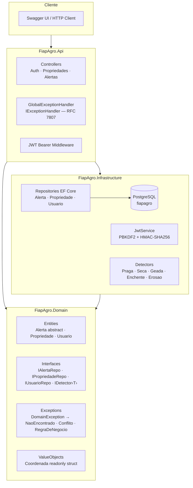
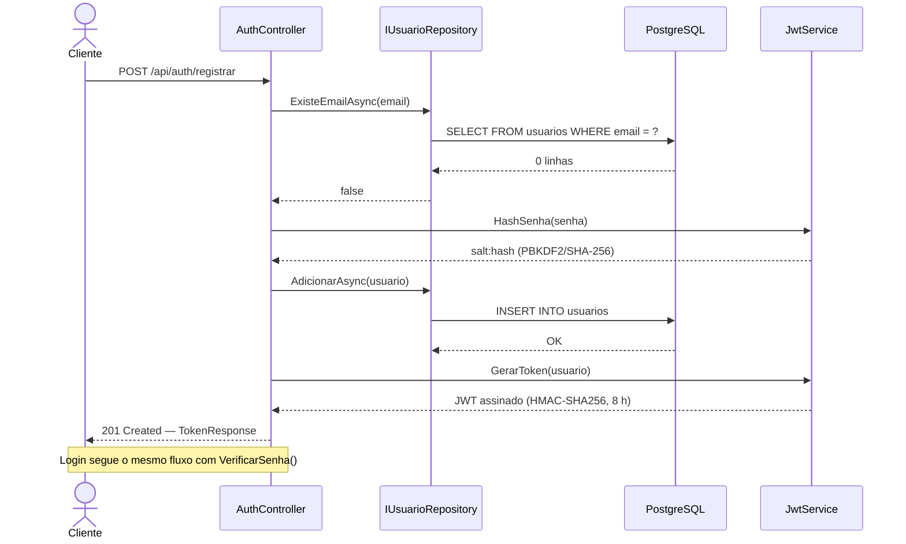
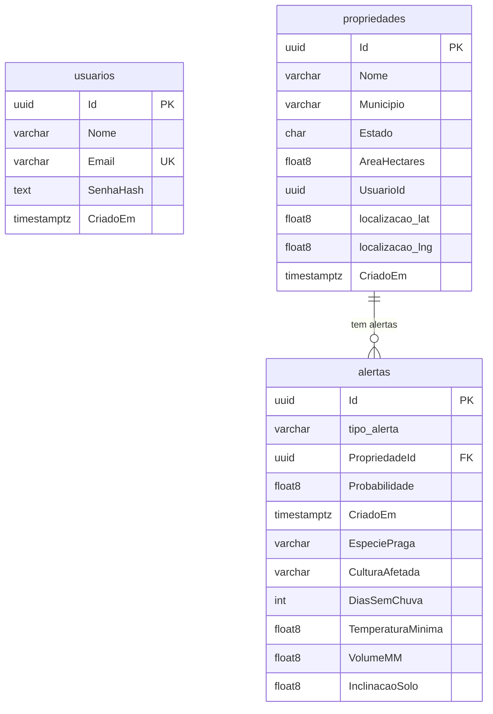

# FiapAgro — Backend

> API REST .NET 8 para monitoramento agroclimático — FIAP Global Solution 2026.1

[](https://github.com/GS-SPACE-CONNECT/2f-agro-backend/actions)
[](https://github.com/GS-SPACE-CONNECT/2f-agro)
[](https://dotnet.microsoft.com)

---

## Sobre o Projeto

O **FiapAgro Backend** é uma Web API que detecta e registra alertas agroclimáticos (pragas, secas, geadas, enchentes e erosão) para propriedades rurais cadastradas. Desenvolvido em C# .NET 8, atende às rubricas de **C# (100 pts)** e **SOA** da FIAP 3ES — GS 2026.1.

## Equipe

| GitHub | Nome |
|--------|------|
| [@brnleao](https://github.com/brnleao) | Bruno Leão |
| [@DevRuanVieira](https://github.com/DevRuanVieira) | Ruan Vieira |
| [@jota0802](https://github.com/jota0802) | José Otávio |

---

## Stack Técnica

| Componente | Tecnologia |
|---|---|
| Runtime | .NET 8 (C# 12) |
| Web Framework | ASP.NET Core Web API |
| ORM | Entity Framework Core 8 |
| Banco de Dados | PostgreSQL 15 + Npgsql 8 |
| Autenticação | JWT Bearer — HMAC-SHA256 |
| Hash de senha | PBKDF2/SHA-256 (`Rfc2898DeriveBytes`, 10 000 iterações) |
| Documentação | Swagger / OpenAPI (Swashbuckle 6) |
| Testes | xUnit 2.5 |
| Exceções | `IExceptionHandler` .NET 8 + RFC 7807 ProblemDetails |

---

## Arquitetura

O projeto segue a **Arquitetura em Camadas** com dependências unidirecionais:

```
FiapAgro.Api  →  FiapAgro.Domain  ←  FiapAgro.Infrastructure
```

### Diagrama de Camadas



---

### Diagrama de Classes — Hierarquia de Alertas


---

### Diagrama de Fluxo — Ciclo de Autenticação



---

### Diagrama de Fluxo — Tratamento de Exceções


---

### Diagrama ER — Banco de Dados



> `alertas` usa **Table-Per-Hierarchy (TPH)**: uma única tabela com coluna discriminadora `tipo_alerta`.

---

## Rubrica C# — Checklist

| # | Item | Pts | Implementação |
|---|------|:---:|---|
| 4 | Classes abstratas + herança + polimorfismo | 20 | `Alerta` (abstract) → 5 herdeiros; `CalcularSeveridade()` e `Recomendacao()` sobrescritos em cada subclasse |
| 5 | Interfaces + injeção de dependência | 20 | `IAlertaRepository`, `IPropriedadeRepository`, `IUsuarioRepository`, `IDetector<T>`, `INotificador` — todos Scoped via `AddFiapAgroServices()` |
| 6 | Structs + Partial Classes | 5 | `readonly struct Coordenada` (GPS, value-semantics, IEquatable); `partial class Propriedade` (estado / comportamento em arquivos separados) |
| 7 | EF Core + migrations + PostgreSQL | 20 | TPH para `Alerta`, `ComplexProperty` para `Coordenada`, 2 migrations, seed automático na startup |
| 8 | Controllers + endpoints REST | 10 | 3 controllers · 15 endpoints · DTOs tipados (records) · `CreatedAtAction` |
| 9 | Tratamento de exceções | 10 | Hierarquia `DomainException` → `GlobalExceptionHandler` (`IExceptionHandler` .NET 8) → RFC 7807 ProblemDetails com `traceId` |
| 10 | Auth + JWT | 15 | `JwtService` (PBKDF2 + HMAC-SHA256) · `AuthController` · `[Authorize]` · Swagger Bearer |
| 11 | README + diagrama + evidências | 30 | Este arquivo + Mermaid (camadas · classes · fluxo · ER) + `docs/evidencias/` |
| | **Total** | **130** | |

---

## Endpoints REST

### Auth (público)

| Método | Rota | Status | Descrição |
|--------|------|:------:|-----------|
| `POST` | `/api/auth/registrar` | 201 | Cadastra usuário e retorna JWT |
| `POST` | `/api/auth/login` | 200 | Autentica e retorna JWT |

### Propriedades (🔒 Bearer JWT)

| Método | Rota | Status | Descrição |
|--------|------|:------:|-----------|
| `GET` | `/api/propriedades?usuarioId={guid}` | 200 | Lista propriedades do usuário |
| `GET` | `/api/propriedades/{id}` | 200 / 404 | Busca por Id |
| `POST` | `/api/propriedades` | 201 | Cadastra nova propriedade |
| `PUT` | `/api/propriedades/{id}` | 200 / 404 | Atualiza dados |
| `DELETE` | `/api/propriedades/{id}` | 204 / 404 | Remove propriedade |

### Alertas (🔒 Bearer JWT)

| Método | Rota | Status | Descrição |
|--------|------|:------:|-----------|
| `GET` | `/api/alertas/recentes?quantidade=20` | 200 | Últimos N alertas |
| `GET` | `/api/alertas/propriedade/{id}` | 200 | Alertas de uma propriedade |
| `GET` | `/api/alertas/{id}` | 200 / 404 | Alerta por Id |
| `POST` | `/api/alertas/praga` | 201 | Registra alerta de praga |
| `POST` | `/api/alertas/seca` | 201 | Registra alerta de seca |
| `POST` | `/api/alertas/geada` | 201 | Registra alerta de geada |
| `POST` | `/api/alertas/enchente` | 201 | Registra alerta de enchente |
| `POST` | `/api/alertas/erosao` | 201 | Registra alerta de erosão |

Erros retornam **ProblemDetails (RFC 7807)**:

```json
{
  "status": 404,
  "title": "Recurso não encontrado",
  "detail": "Propriedade 'abc...' não encontrado.",
  "traceId": "00-abc123..."
}
```

---

## Configuração e Execução

### Pré-requisitos

- [.NET 8 SDK](https://dotnet.microsoft.com/download/dotnet/8.0)
- [PostgreSQL 15+](https://www.postgresql.org/) **ou** Docker

### PostgreSQL com Docker

```bash
docker run --name fiapagro-pg \
  -e POSTGRES_USER=postgres \
  -e POSTGRES_PASSWORD=postgres \
  -e POSTGRES_DB=fiapagro \
  -p 5432:5432 -d postgres:15
```

### appsettings.json

```json
{
  "ConnectionStrings": {
    "Default": "Host=localhost;Port=5432;Database=fiapagro;Username=postgres;Password=postgres"
  },
  "Jwt": {
    "SecretKey": "chave_secreta_com_minimo_32_caracteres_aqui!",
    "Issuer": "FiapAgro.Api",
    "Audience": "FiapAgro.Clients",
    "ExpiresHours": "8"
  }
}
```

### Executar

```bash
# 1. Restaurar pacotes
dotnet restore

# 2. Aplicar migrations (cria tabelas + seed automático na startup)
dotnet ef database update --project FiapAgro.Infrastructure --startup-project FiapAgro.Api

# 3. Subir a API
dotnet run --project FiapAgro.Api
```

A API sobe em `http://localhost:5000` · Swagger em `http://localhost:5000/swagger`.

### Testes unitários

```bash
dotnet test --verbosity normal
```

---

## Evidências de Execução

Exemplos completos de requisições HTTP em [`docs/evidencias/requests.http`](docs/evidencias/requests.http) (VS Code REST Client).

**Como usar:**
1. Instale a extensão [REST Client](https://marketplace.visualstudio.com/items?itemName=humao.rest-client) no VS Code
2. Suba a API: `dotnet run --project FiapAgro.Api`
3. Abra `docs/evidencias/requests.http` → clique em **Send Request** em cada bloco

**Fluxo de teste recomendado:**

```
1. POST /api/auth/registrar  → copiar o token
2. POST /api/auth/login      → confirmar autenticação
3. POST /api/propriedades    → criar propriedade (usar o token)
4. POST /api/alertas/praga   → criar alerta
5. GET  /api/alertas/recentes → listar alertas
```

O Swagger (`/swagger`) também serve como evidência interativa — autentique com o token JWT no botão **Authorize 🔒** e execute os endpoints diretamente no browser.

---

## Estrutura de Pastas

```
2f-agro-backend/
├── FiapAgro.Api/
│   ├── Controllers/        # AuthController · PropriedadesController · AlertasController
│   ├── Dtos/               # Records tipados para request/response
│   ├── Middleware/         # GlobalExceptionHandler (IExceptionHandler)
│   └── Program.cs          # Pipeline, DI, JWT, Swagger, migrations
├── FiapAgro.Domain/
│   ├── Entities/           # Alerta (abstract) + 5 herdeiros · Propriedade (partial) · Usuario
│   ├── Exceptions/         # DomainException · NaoEncontrado · Conflito · RegraDeNegocio
│   ├── Interfaces/         # IAlertaRepository · IPropriedadeRepository · IUsuarioRepository · IDetector‹T›
│   └── ValueObjects/       # Coordenada (readonly struct)
├── FiapAgro.Infrastructure/
│   ├── Auth/               # JwtService (PBKDF2 + JWT)
│   ├── Data/               # AppDbContext · Migrations · Seed
│   ├── Detectors/          # DetectorPraga · Seca · Geada · Enchente · Erosao
│   ├── Repositories/       # Implementações EF Core dos repositórios
│   └── Extensions/         # ServiceCollectionExtensions (AddFiapAgroServices)
├── FiapAgro.Tests/         # xUnit — testes de domínio
└── docs/evidencias/        # requests.http + exemplos de resposta
```
